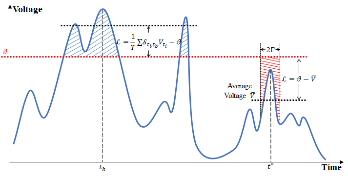

# ATCA-SNN

PyTorch implementation of "Attention-Based Deep Spiking Neural Networks for Temporal Credit Assignment Problems" (ATCA). If you use our code or data please cite the [paper](<https://ieeexplore.ieee.org/document/10038509/>).

Spiking Neural Networks (SNNs) are trained using PyTorch 1.8.0 and Python 3.8.

## Abstract

The temporal credit assignment (TCA) problem, which aims to detect predictive features hidden in distracting background streams, remains a core challenge in biological and machine learning. Aggregate-label learning is proposed by researchers to resolve this problem by matching spikes with delayed feedback. However, the existing aggregate-label learning algorithms only consider the information of a single moment, which is inconsistent with the real situation. Meanwhile, there is no quantitative evaluation method for TCA problems. To address these limitations, we propose a novel attention-based temporal credit assignment (ATCA) algorithm and a minimum editing distance (MED)-based quantitative evaluation method. Specifically, we define a loss function based on the attention mechanism to deal with the information contained within the spike clusters and use MED to evaluate the similarity between the spike train and the target clue flow. Experimental results on musical instrument recognition (MedleyDB), speech recognition (TIDIGITS), and gesture recognition (DVS128-Gesture) show that the ATCA algorithm can reach the state-of-the-art level compared to other aggregate-label learning algorithms.



## Results

| Datasets    | Model       | Accuracy (%)  | TCA Similarity (%)|
| :----:      |   :----:    |    :----:     |       :----:      |
| MedleyDB   | Specialized CNN <br> LSTM <br> Deep SNN <br> SLAYER <br> STCA <br> **Ours (ATCA)**  | 97.51 <br> 94.62 <br> 80.73 <br> - <br> 97.25 <br> **98.59** | - <br> - <br> - <br> 48.23 <br> 89.22 <br> **92.33** <br>|
| TIDIGITS    | Single layer SNN <br> Spiking CNN <br> MFCC and RNN <br> LSM <br> ETDP <br> MPD-AL <br> SLAYER <br> STCA <br> **Ours (ATCA)** | 91.00 <br> 96.00 <br> 96.10 <br> 92.30 <br> 95.80 <br> 95.35 <br> - <br> 94.81 <br> **97.20** | - <br> - <br> - <br> - <br> - <br> - <br> 59.50 <br> 89.95 <br> **91.51**|
| DVS-Gesture | SLAYER <br> STCA <br> **Ours (ATCA)** | - <br> 79.75 <br> **90.54** | 39.24 <br> 69.58 <br> **77.08**|

## Usage

To reproduce the results in our paper:
> python main_TD.py

All params can be changed in params.py. For recognition tasks, please use MSE loss function. For TCA tasks, please use "ATCA_TCA_Loss" in loss_func.py.

The code in the main branch is using for instrument recognition and sound classification, and the code in the "DVS-Gesture" branch are wiriting for event data.

## Neuron Params Test

To study the influence of parameters of spiking neurons on the results, please refer to the code of the "Neuron_Params_Test" branch. You can compare the experimental results by setting different parameter training modes.

## Citation

```
@article{Qin2023Attention,
author={Qin, Lang and Wang, Ziming and Yan, Rui and Tang, Huajin},
journal={IEEE Transactions on Neural Networks and Learning Systems},
title={Attention-Based Deep Spiking Neural Networks for Temporal Credit Assignment Problems},
year={2023},
pages={1-11},
doi={10.1109/TNNLS.2023.3240176}}
